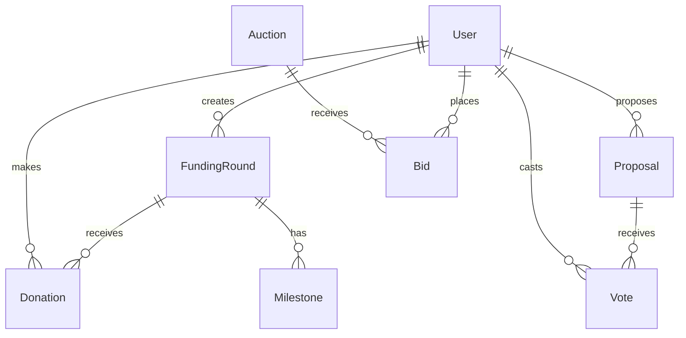

# ImpactChain Backend - AI × Blockchain Charity Platform

## 🚀 Quick Start

```bash
# Clone and install dependencies
git clone <repo>
cd backend
pnpm install

# Start infrastructure services
docker-compose -f docker-compose.dev.yml up -d

# Generate Prisma client and run migrations
pnpm db:generate
pnpm db:migrate

# Deploy smart contracts to Mumbai testnet
pnpm contracts:deploy:mumbai

# Start all services in development mode
pnpm dev
```

## 📋 System Overview

Complete production-grade backend for an AI-powered blockchain charity platform featuring:

- **🏗️ Microservices Architecture**: 7 independent services with GraphQL Federation
- **⛓️ Smart Contracts**: 7 Solidity contracts on Polygon with 95%+ test coverage
- **🔄 Event-Driven**: NATS JetStream for real-time communication
- **🤖 AI Integration**: ML service placeholders with gRPC interfaces
- **🔐 Security First**: JWT auth, rate limiting, input validation, audit trails
- **📊 Observability**: OpenTelemetry tracing, Prometheus metrics, health checks
- **🚢 Production Ready**: Docker, Kubernetes, Helm charts, CI/CD pipelines

## 🏛️ Architecture

### Smart Contracts (Polygon)
- **GovernanceToken**: ERC-20 with voting, minted on donations (1B cap)
- **ReputationBadge**: SoulBound ERC-721 with 5% annual decay
- **DAOCore**: Governor + Timelock for decentralized governance
- **FundingRound**: Milestone-based escrow with oracle verification
- **HelpDesk**: Direct aid distribution with DAO approval
- **AuctionHouse**: English auctions with 72h finalization
- **FundingRoundFactory**: Deploys campaigns after DAO approval

### Microservices
- **Auth Service**: JWT authentication with RBAC
- **DAO Service**: Governance with quadratic voting
- **Funding Service**: Campaign management with ML KPI verification
- **HelpDesk Service**: Direct assistance with priority algorithms
- **Auction Service**: NFT marketplace with streaming payments
- **ML-Stub Service**: AI integration ready for model deployment
- **Notifier Service**: Multi-channel notifications (Email/SMS)

### Gateway
- **GraphQL Federation**: Apollo Gateway with schema stitching
- **REST API**: OpenAPI/Swagger with webhook support
- **Rate Limiting**: Per-endpoint throttling
- **Security**: Helmet, CORS, input validation

## 🛠️ Tech Stack

- **Runtime**: Node.js 20
- **Language**: TypeScript 5 (strict null checks)
- **Framework**: NestJS 10 with Fastify
- **Database**: PostgreSQL 15 + Prisma ORM
- **Blockchain**: Polygon PoS (Hardhat + Foundry)
- **Messaging**: NATS JetStream
- **Jobs**: BullMQ + Redis
- **Monitoring**: OpenTelemetry + Grafana
- **Deployment**: Docker + Kubernetes + Helm

## 📊 Data Models



## 🔥 Key Features

### Advanced DAO Features
- **Quadratic Voting**: `sqrt(tokens)` for fair representation
- **Matching Funds**: 1x-4x community multipliers
- **Streaming Payments**: Sablier-style continuous releases
- **Reputation Decay**: 5% annual unless active
- **Carbon Offsets**: Automatic Toucan Protocol integration

### ML Integration
- **KPI Verification**: Satellite imagery + oracle validation
- **Fraud Detection**: Suspicious pattern recognition
- **Churn Prediction**: Donor retention modeling
- **Need Ranking**: Priority algorithms for help requests

### Security & Compliance
- **Multi-signature**: Critical operations protection
- **Audit Trails**: Complete transaction history
- **Rate Limiting**: DDoS protection
- **Input Validation**: SQL injection prevention
- **Smart Contract Audits**: Slither + manual review

## 🚀 Development

### Prerequisites
- Node.js 20+
- PostgreSQL 15+
- Redis 7+
- Docker & Docker Compose
- pnpm 8+

### Environment Setup
```bash
# Copy environment template
cp .env.example .env

# Edit configuration
vim .env
```

### Database Setup
```bash
# Start PostgreSQL
docker-compose -f docker-compose.dev.yml up postgres -d

# Run migrations
pnpm db:migrate

# Seed development data
pnpm db:seed
```

### Smart Contract Development
```bash
# Compile contracts
pnpm contracts:compile

# Run tests with coverage
pnpm contracts:coverage

# Deploy to Mumbai testnet
pnpm contracts:deploy:mumbai

# Verify contracts
pnpm contracts:verify:mumbai
```

### Service Development
```bash
# Start all services
pnpm dev

# Start specific service
cd packages/services/auth
pnpm start:dev

# Run service tests
pnpm test
```

## 🧪 Testing

### Smart Contracts
```bash
# Hardhat tests
pnpm contracts:test

# Foundry tests
pnpm foundry:test

# Coverage report
pnpm contracts:coverage
```

### Backend Services
```bash
# Unit tests
pnpm test

# E2E tests
pnpm test:e2e

# Coverage report
pnpm test:cov
```

## 📈 Monitoring

### Health Checks
- **Services**: `http://localhost:3000/healthz`
- **Database**: Connection pool status
- **Redis**: Memory usage and connectivity
- **NATS**: JetStream consumer lag

### Metrics
- **API Performance**: Response times, error rates
- **Database**: Query performance, connection count
- **Smart Contracts**: Gas usage, transaction success
- **Business**: Donations, campaigns, user activity

### Tracing
- **OpenTelemetry**: Distributed request tracing
- **Jaeger**: Trace visualization
- **Service Map**: Inter-service dependencies

## 🚢 Deployment

### Local Development
```bash
# Infrastructure only
docker-compose -f docker-compose.dev.yml up -d

# Full stack with services
pnpm dev
```

### Staging Environment
```bash
# Build Docker images
pnpm build
docker build -t impactchain/gateway apps/gateway

# Deploy with Helm
helm upgrade --install gateway ./charts/gateway
```

### Production Deployment
```bash
# CI/CD Pipeline (GitHub Actions)
git push origin main

# Manual deployment
kubectl apply -f infra/k8s/
```

## 📚 API Documentation

### GraphQL
- **Playground**: `http://localhost:3000/graphql`
- **Schema**: Auto-generated from federated services
- **Subscriptions**: Real-time updates via WebSocket

### REST API
- **Swagger UI**: `http://localhost:3000/docs`
- **OpenAPI Spec**: `/docs-json`
- **Postman Collection**: `./docs/impactchain.postman_collection.json`

## 🔐 Authentication

### JWT Tokens
```bash
# Login
curl -X POST http://localhost:3001/auth/login \
  -H "Content-Type: application/json" \
  -d '{"email": "user@example.com", "password": "password"}'

# Use token
curl -H "Authorization: Bearer <token>" \
  http://localhost:3000/graphql
```

### Roles & Permissions
- **Admin**: Full system access
- **Member**: Standard user operations
- **Founder**: Campaign creation and management

## 🌐 Smart Contract Addresses

### Mumbai Testnet
```
GovernanceToken: 0x...
ReputationBadge: 0x...
DAOCore: 0x...
FundingRoundFactory: 0x...
HelpDesk: 0x...
AuctionHouse: 0x...
```

### Polygon Mainnet
```
GovernanceToken: 0x...
ReputationBadge: 0x...
DAOCore: 0x...
FundingRoundFactory: 0x...
HelpDesk: 0x...
AuctionHouse: 0x...
```

## 🤝 Contributing

### Development Process
1. Fork the repository
2. Create feature branch: `git checkout -b feature/amazing-feature`
3. Make changes with tests
4. Run full test suite: `pnpm test`
5. Submit pull request

### Code Standards
- **TypeScript**: Strict mode with null checks
- **ESLint**: Enforced code style
- **Prettier**: Auto-formatting
- **Conventional Commits**: Semantic versioning
- **Test Coverage**: >90% for new code

## 📖 Documentation

- **API Reference**: [GraphQL Schema](./docs/graphql-schema.md)
- **Smart Contracts**: [Contract Documentation](./packages/contracts/README.md)
- **Deployment Guide**: [K8s Deployment](./docs/deployment.md)
- **ML Integration**: [AI Service Specs](./docs/ML_TASKS.md)
- **Architecture Decision Records**: [ADRs](./docs/adr/)

## 🐛 Troubleshooting

### Common Issues

**Database Connection Failed**
```bash
# Check PostgreSQL status
docker-compose -f docker-compose.dev.yml ps postgres

# Restart database
docker-compose -f docker-compose.dev.yml restart postgres
```

**Smart Contract Deployment Failed**
```bash
# Check network configuration
npx hardhat compile
npx hardhat verify --network mumbai <address>
```

**Service Health Check Failed**
```bash
# Check service logs
kubectl logs -f deployment/auth-service

# Port forward for debugging
kubectl port-forward svc/auth-service 3001:3001
```

## 📞 Support

- **Issues**: [GitHub Issues](https://github.com/impactchain/backend/issues)
- **Discussions**: [GitHub Discussions](https://github.com/impactchain/backend/discussions)
- **Security**: security@impactchain.org
- **Documentation**: [GitBook](https://docs.impactchain.org)

## 📄 License

MIT License - see [LICENSE](LICENSE) file for details.

---

**Built with ❤️ for global impact** 